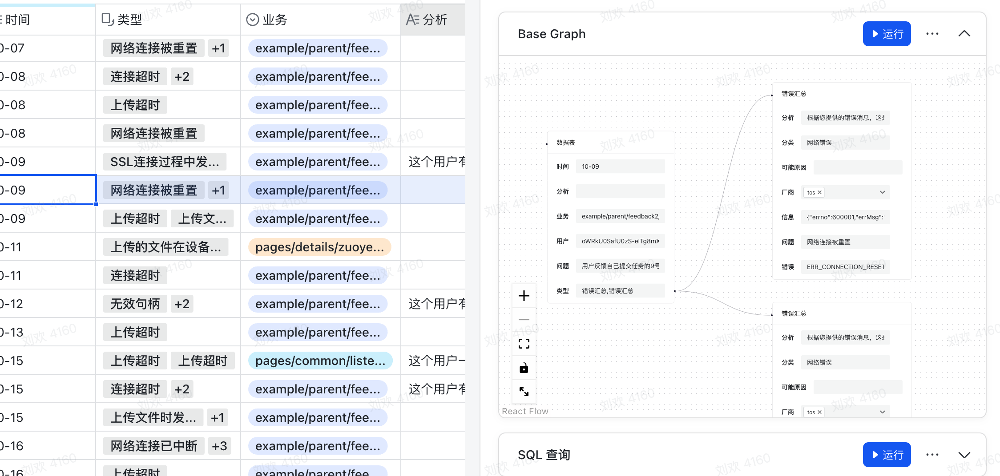

## Base Graph



### Why

通过这个插件我们可以快速的查到与这条记录关联的数据进行查看。

### Feature

- 全屏查看
- 链路数据查询

### Getting Started

1️⃣ clone deme

```
git clone https://github.com/WumaCoder/bs-graph
pnpm install
pnpm dev
```

2️⃣ 复制 http://localhost:3000/ 到 多维表格 webview 地址
